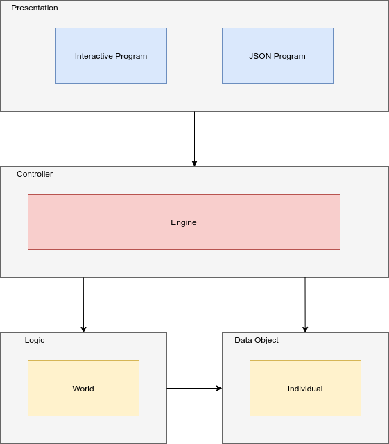

# Ailo Coding Challenge - Zombie Apocalypse v4.5 


Table of contents
============================
* [Requirement](#requirement)
* [Set Up](#set-up)
* [Usage](#usage)
* [Test](#test)
* [Strategy](#strategy)
* [System Architecture Design](#system-architecture-design)

Requirement
===
This program is implemented in Python. The followings are required to run this program.
1. Python >= 3.6
2. pipenv

Set Up
===
To set up, clone this repo.
```
git clone https://github.com/Susros/ailo-zombie-apocalypse.git
```

In the project, run:

```
pipenv install
```

Execute virtual python environment

```
pipenv shell
```

Usage
===
There are two ways to run this program.

## Interactive program

To use CLI interactive program, run

```
python cli.py
```

This will prompt input on console to enter information.

## JSON Program

If you wish to run the program with JSON file, run

```
python main.py
```

This requires `input.json` in `data/` directory. The format of input is as follow:

```json
{
    "game": [
        {
            "n": 4,
            "zombie": { "x": 2, "y": 1 },
            "creatures": [
                { "x": 0, "y": 1 },
                { "x": 1, "y": 2 },
                { "x": 3, "y": 1 }
            ],
            "moves": "DLUURR"
        }
    ]
}
```

Test
===

Tests are implemented using pytest. To execute test, run
```
pytest
```

Strategy
===

First, there is an initial zombie with initial position given to it. Then, the number of creatures are created. All those populated creatures and zombie are store in a list. 2D array is used as a data structure to make them visible in the map with its coordinates. So, when zombie moves and see the creature, it takes the index of the population and identifies the creature whether it is zombie or not. If not zombie, that creature is then infected. Another list is created as a queue to queue the newly affcted zombies to action once the current zombie moves are completed.

System Architecture Design
===

